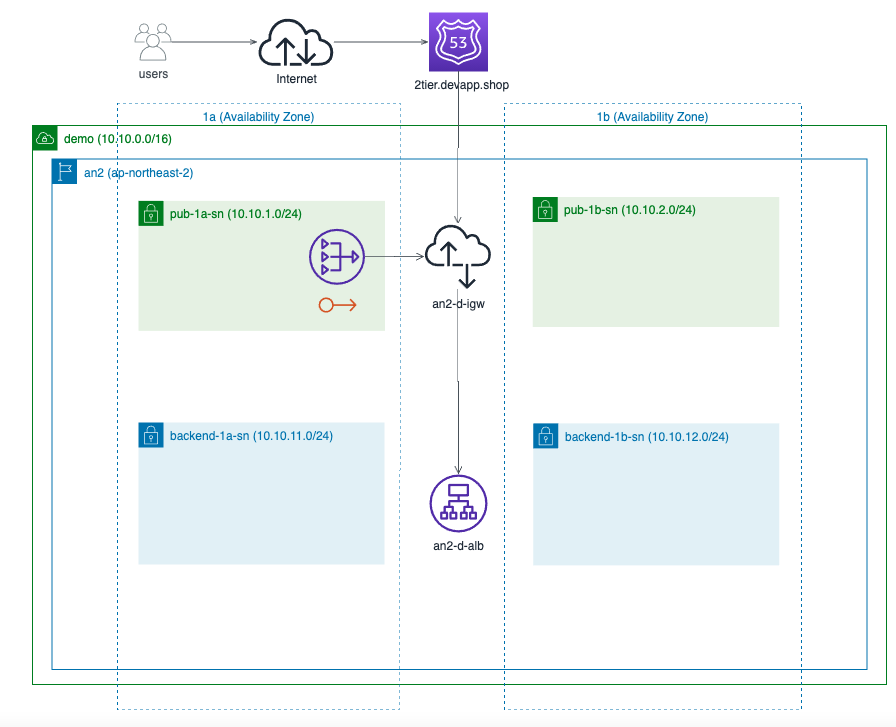
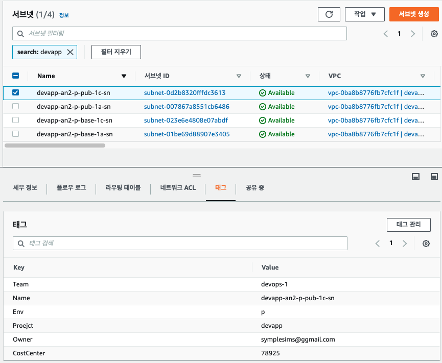
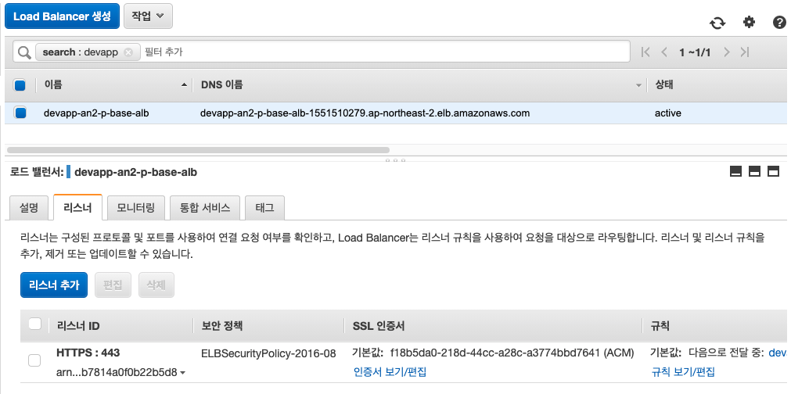

# opsflex-vpc
opsflex 플랫폼을 위한 Infra-Structure를 구성 합니다.


## 아키텍쳐 구성도
AWS VPC 구성 다이어그램 입니다. 여기에는 VPC 를 구성하는 기본 자원인 Internet Gateway, Nat Gateway, 
Subnet 및 Routing-Table, Security-Group, ALB, 애플리케이션을 위한 IAM 및 TargetGroup 등을 구성 합니다. 

  

AWS 리소스의 명세를 위해 [AWS Architecture Specification Template](!./docs/devapp Architecture Specification.xlsx) 파일을 사용하면 편리 합니다.


## 프로젝트 레이아웃
<!--
tree . --dirsfirst
//-->

```bash
.
├── docs.
│   ├── images
│   │   └── infra-01.png                    AWS 클라우드의 VPC 기본 정보를 포함 하고 있습니다.
│   ├── Resource\ Specification.xlsx              AWS 클라우드 아키텍처 스펙을 정의 하는 템플릿 양식 입니다.
│   ├── apply-out.md
│   └── plan-out.md
├── modules                                             Shared 모듈을 정의 합니다.
│   ├── elb                                       ELB 모듈 
│   │   ├── alb.tf
│   │   ├── data.tf
│   │   ├── outputs.tf
│   │   ├── security-group.tf
│   │   ├── target-group.tf
│   │   └── variables.tf
│   ├── iam                                       IAM 모듈 정의 (codedeploy, ssm, s3 액세스 권한 등)
│   │   ├── data.tf
│   │   ├── iam-role.tf
│   │   ├── outputs.tf
│   │   └── variables.tf
│   └── vpc                                       devapp VPC 모듈 정의
│       ├── outputs.tf
│       ├── variables.tf
│       └── vpc.tf
├── services
│   └── devapp-base                               devapp VPC 에 필요한 네트워크 리소스를 정의 합니다.
│       ├── eip.tf
│       ├── internet-gateway.tf
│       ├── nat-gateway.tf
│       ├── outputs.tf
│       ├── route-table.tf
│       ├── subnet.tf
│       └── variables.tf                          devapp VPC 인프라를 구성하는 기본 정보들을 포함 합니다.
├── README.md
├── main.tf
├── terraform.tfstate
└── variables.tf


```


## AWS 프로파일 구성 
AWS 인프라 스트럭처를 프로비저닝 할 수 있는 IAM 계정을 생성 하고 Policy 추가 및 accessKey 를 발급 받습니다.  
[Creating an IAM user in your AWS account](https://docs.aws.amazon.com/IAM/latest/UserGuide/id_users_create.html#id_users_create_console) 가이드를 참고하여 생성 합니다.


## AWS CLI 설치

[AWS CLI 설치](https://docs.aws.amazon.com/ko_kr/cli/latest/userguide/cli-chap-install.html) 가이드를 참고하여 설치 합니다.


## AWS PROFILE 구성
[terraform](https://registry.terraform.io/providers/hashicorp/aws/latest/docs) 을 이용하여 REAL 인프라스트럭처를 프로비저닝 하기 위해 profile 을 구성 합니다.  
본 예제 에서는 'terra' 프로파일을 통해 AWS 자원을 컨트롤 합니다.

```bash
macOS ~ $ aws configure --profile terra
AWS Access Key ID [None]: ABC*************
AWS Secret Access Key [None]: ************
Default region name [None]: ap-northeast-2
Default output format [None]: json
```

## 프로젝트 clone 및 테라폼 init 

```bash

mkdir -p ~/workspace
cd ~/workspace

git clone https://github.com/osssample/devapp-vpc.git
cd ~/workspace/devapp-vpc

terraform init
```


## Plan 을 통한 Real 인프라스트럭쳐 검토

```bash
terraform plan
```
Plan 결과는 [plan-out](./docs/plan-out.md) 파일 내용을 참고 할 수 있습니다.


## Apply 을 통한 Real 인프라스트럭쳐 프로비저닝 

```bash
terraform apply
```

Apply 를 통해 Real 인프라스트럭처가 프로비저닝 됩니다.  
[apply-out](./docs/apply-out.md) 파일 내용을 참고 할 수 있습니다.


## 테라폼 프로비저닝 결과 확인 
[terraform](https://terraform.io) 을 통해 프로비저닝된 주요 자원으로 vpc, subnet, alb 를 확인 하면 다음과 같습니다.


### VPC
리소스 이름과 태깅 정보가 체계적으로 생성됨을 확인 할 수 있습니다.  
  


### Subnets
CIDR 블럭 및 public / private subnet 이 잘 구성 됨을 확인 할 수 있습니다.  
  


### ALB
TLS 리스닝 포트와 ACM 인증서는 물론 타겟 그룹 지정까지 잘 구성됨을 확인할 수 있습니다.  
  


## destroy 을 통한 자원의 폐기

```bash
terraform destroy
```
destroy 명령은 "devapp-vpc" 프로젝트에 정의된 모든 resource 를 terminated 하게 됩니다.
더 이상 리소스들이 필요 없어 졌을때 신속하게 폐기하여 불필요한 비용을 낭비하지 않습니다.

## 결론
이상으로 [terraform](https://terraform.io)을 사용하여 클라우드 자원을 구성 하게 되면 신속하고 
정확하게 Real 인프라스트럭처를 프로비저닝 함은 물론 리소스를 정의한 스펙이 Code에 고스란히 남아 있으므로
인프라 구성의 상세 스펙과 사용자의 실수로 인해 발생할 수 있는 위험을 예방 할 수 있습니다.


